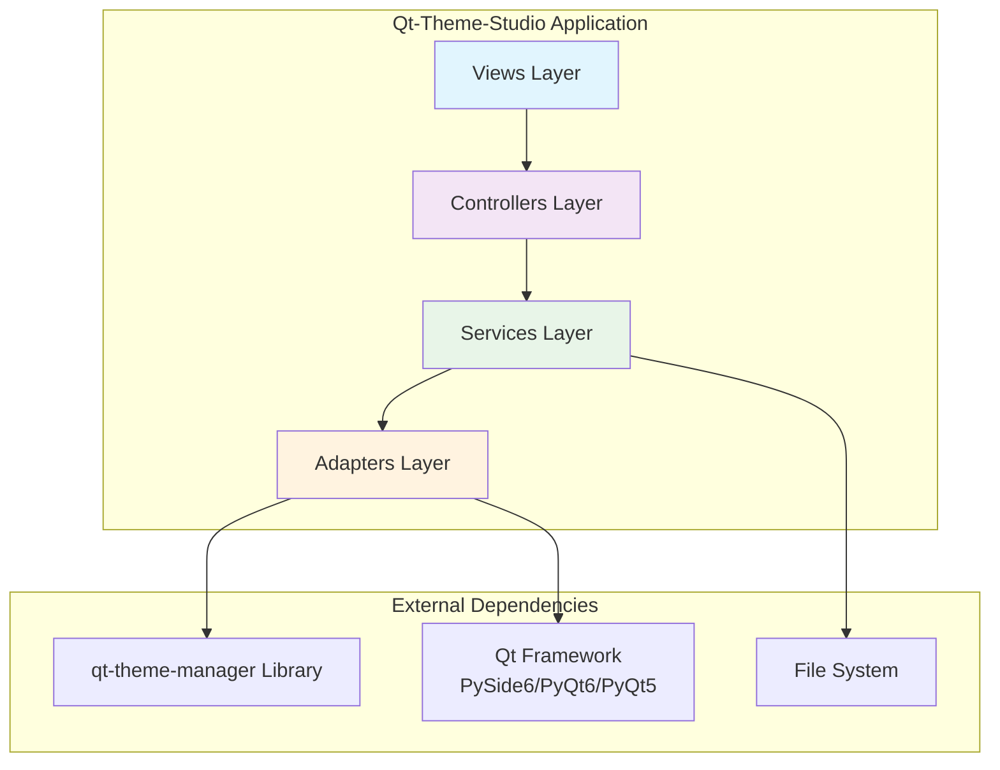

# Design Document

## Overview

Qt-Theme-Studioは、qt-theme-managerライブラリを基盤とした統合テーマエディターGUIアプリケーションです。MVCアーキテクチャパターンとアダプターパターンを採用し、PySide6/PyQt6/PyQt5の自動検出機能を活用して、開発者に直感的なテーマ作成・編集環境を提供します。

### 設計原則

1. **関心の分離**: ライブラリ機能とGUI機能の明確な分離
2. **拡張性**: 新しいテーマ形式やウィジェットタイプへの対応
3. **アクセシビリティ**: WCAG準拠のテーマ作成支援
4. **ユーザビリティ**: 直感的なビジュアルインターフェース
5. **国際化**: 日本語インターフェースの完全対応

## Architecture

### 全体アーキテクチャ



### MVCアーキテクチャパターン

- **Model (Services Layer)**: データ管理とビジネスロジック
- **View (Views Layer)**: UIコンポーネントとユーザーインターフェース
- **Controller (Controllers Layer)**: ユーザー操作とデータ処理の橋渡し

### アダプターパターン

- **Theme Adapter**: qt-theme-managerライブラリとの統合
- **Qt Adapter**: 異なるQtフレームワーク間の互換性保証

## Components and Interfaces

### 1. Application Core

#### Main Application (`qt_theme_studio/main.py`)
```python
class ThemeStudioApplication:
    """メインアプリケーションクラス"""
    
    def __init__(self):
        self.qt_adapter = QtAdapter()
        self.theme_adapter = ThemeAdapter()
        self.main_window = None
    
    def initialize(self) -> bool:
        """アプリケーション初期化"""
        # Qt フレームワーク自動検出
        # qt-theme-manager ライブラリ統合
        # 設定ファイル読み込み
        
    def run(self) -> int:
        """アプリケーション実行"""
```

#### Configuration Management (`qt_theme_studio/config/`)
```python
class ApplicationSettings:
    """アプリケーション設定管理"""
    
    def load_settings(self) -> Dict[str, Any]:
        """設定ファイル読み込み"""
        
    def save_settings(self, settings: Dict[str, Any]) -> None:
        """設定ファイル保存"""
        
    def get_recent_themes(self) -> List[str]:
        """最近使用したテーマリスト取得"""
```

### 2. Adapters Layer

#### Qt Framework Adapter (`qt_theme_studio/adapters/qt_adapter.py`)
```python
class QtAdapter:
    """Qt フレームワーク自動検出・統合アダプター"""
    
    def detect_qt_framework(self) -> str:
        """PySide6 → PyQt6 → PyQt5 の順で自動検出"""
        
    def get_qt_modules(self) -> Dict[str, Any]:
        """検出されたQtモジュールを返す"""
        
    def create_application(self) -> QApplication:
        """QApplicationインスタンス作成"""
```

#### Theme Manager Adapter (`qt_theme_studio/adapters/theme_adapter.py`)
```python
class ThemeAdapter:
    """qt-theme-manager ライブラリ統合アダプター"""
    
    def initialize_theme_manager(self) -> bool:
        """テーママネージャー初期化"""
        
    def load_theme(self, theme_path: str) -> Theme:
        """テーマファイル読み込み"""
        
    def save_theme(self, theme: Theme, path: str) -> bool:
        """テーマファイル保存"""
        
    def export_theme(self, theme: Theme, format: str) -> str:
        """テーマエクスポート（JSON/QSS/CSS）"""
```

### 3. Views Layer

#### Main Window (`qt_theme_studio/views/main_window.py`)
```python
class MainWindow(QMainWindow):
    """メインウィンドウ"""
    
    def __init__(self):
        self.theme_editor = ThemeEditor()
        self.zebra_editor = ZebraEditor()
        self.preview_window = PreviewWindow()
        self.theme_gallery = ThemeGallery()
    
    def setup_ui(self) -> None:
        """UI初期化"""
        
    def setup_menu_bar(self) -> None:
        """メニューバー設定"""
        
    def setup_toolbar(self) -> None:
        """ツールバー設定"""
```

#### Theme Editor (`qt_theme_studio/views/theme_editor.py`)
```python
class ThemeEditor(QWidget):
    """統合テーマエディター"""
    
    def __init__(self):
        self.color_picker = ColorPicker()
        self.font_selector = FontSelector()
        self.property_editor = PropertyEditor()
    
    def setup_ui(self) -> None:
        """エディターUI構築"""
        
    def on_property_changed(self, property: str, value: Any) -> None:
        """プロパティ変更イベント"""
```

#### Zebra Pattern Editor (`qt_theme_studio/views/zebra_editor.py`)
```python
class ZebraEditor(QWidget):
    """WCAG準拠ゼブラパターンエディター"""
    
    def __init__(self):
        self.contrast_calculator = ContrastCalculator()
        self.accessibility_checker = AccessibilityChecker()
    
    def calculate_contrast_ratio(self, color1: str, color2: str) -> float:
        """コントラスト比計算"""
        
    def suggest_improvements(self, colors: List[str]) -> List[str]:
        """色改善提案"""
```

#### Live Preview (`qt_theme_studio/views/preview.py`)
```python
class PreviewWindow(QWidget):
    """ライブプレビューウィンドウ"""
    
    def __init__(self):
        self.widget_showcase = WidgetShowcase()
        self.preview_controls = PreviewControls()
    
    def update_preview(self, theme: Theme) -> None:
        """プレビュー更新（500ms以内）"""
        
    def export_preview_image(self, path: str) -> bool:
        """プレビュー画像エクスポート"""
```

### 4. Controllers Layer

#### Theme Controller (`qt_theme_studio/controllers/theme_controller.py`)
```python
class ThemeController:
    """テーマ管理コントローラー"""
    
    def __init__(self):
        self.theme_service = ThemeService()
        self.undo_stack = QUndoStack()
    
    def create_new_theme(self) -> Theme:
        """新規テーマ作成"""
        
    def load_theme(self, path: str) -> Theme:
        """テーマ読み込み"""
        
    def save_theme(self, theme: Theme, path: str) -> bool:
        """テーマ保存"""
        
    def undo_last_action(self) -> None:
        """Undo操作"""
        
    def redo_last_action(self) -> None:
        """Redo操作"""
```

#### Zebra Controller (`qt_theme_studio/controllers/zebra_controller.py`)
```python
class ZebraController:
    """ゼブラパターン管理コントローラー"""
    
    def __init__(self):
        self.color_service = ColorService()
        self.accessibility_service = AccessibilityService()
    
    def generate_wcag_compliant_colors(self, level: str) -> List[str]:
        """WCAG準拠色生成（AA/AAA）"""
        
    def validate_accessibility(self, colors: List[str]) -> AccessibilityReport:
        """アクセシビリティ検証"""
```

### 5. Services Layer

#### Theme Service (`qt_theme_studio/services/theme_service.py`)
```python
class ThemeService:
    """テーマ管理サービス"""
    
    def __init__(self):
        self.theme_adapter = ThemeAdapter()
        self.validation_service = ValidationService()
    
    def validate_theme(self, theme: Theme) -> ValidationResult:
        """テーマ検証"""
        
    def convert_theme_format(self, theme: Theme, target_format: str) -> str:
        """テーマ形式変換"""
        
    def get_theme_templates(self) -> List[ThemeTemplate]:
        """テーマテンプレート取得"""
```

#### Export Service (`qt_theme_studio/services/export_service.py`)
```python
class ExportService:
    """エクスポートサービス"""
    
    def export_to_json(self, theme: Theme) -> str:
        """JSON形式エクスポート"""
        
    def export_to_qss(self, theme: Theme) -> str:
        """QSS形式エクスポート"""
        
    def export_to_css(self, theme: Theme) -> str:
        """CSS形式エクスポート"""
        
    def export_preview_image(self, preview: QWidget, path: str) -> bool:
        """プレビュー画像エクスポート"""
```

### 6. Utilities Layer

#### Color Analyzer (`qt_theme_studio/utilities/color_analyzer.py`)
```python
class ColorAnalyzer:
    """色解析ユーティリティ"""
    
    def calculate_contrast_ratio(self, color1: str, color2: str) -> float:
        """WCAG準拠コントラスト比計算"""
        
    def get_color_harmony(self, base_color: str) -> List[str]:
        """調和色生成"""
        
    def analyze_color_accessibility(self, colors: List[str]) -> AccessibilityReport:
        """色アクセシビリティ分析"""
```

#### Color Improver (`qt_theme_studio/utilities/color_improver.py`)
```python
class ColorImprover:
    """色改善ユーティリティ"""
    
    def improve_contrast(self, color1: str, color2: str, target_ratio: float) -> Tuple[str, str]:
        """コントラスト改善"""
        
    def suggest_accessible_alternatives(self, colors: List[str]) -> List[str]:
        """アクセシブル代替色提案"""
```

## Data Models

### Theme Data Model
```python
@dataclass
class Theme:
    """テーマデータモデル"""
    name: str
    version: str
    colors: Dict[str, str]
    fonts: Dict[str, FontConfig]
    sizes: Dict[str, int]
    properties: Dict[str, Any]
    metadata: ThemeMetadata
    
    def validate(self) -> ValidationResult:
        """テーマ検証"""
        
    def to_dict(self) -> Dict[str, Any]:
        """辞書形式変換"""
        
    @classmethod
    def from_dict(cls, data: Dict[str, Any]) -> 'Theme':
        """辞書からテーマ作成"""
```

### Color Configuration
```python
@dataclass
class ColorConfig:
    """色設定データモデル"""
    primary: str
    secondary: str
    background: str
    surface: str
    error: str
    warning: str
    info: str
    success: str
    
    def get_contrast_ratios(self) -> Dict[str, float]:
        """コントラスト比取得"""
```

### Accessibility Report
```python
@dataclass
class AccessibilityReport:
    """アクセシビリティレポート"""
    wcag_level: str  # AA, AAA
    contrast_ratios: Dict[str, float]
    violations: List[AccessibilityViolation]
    suggestions: List[str]
    score: float
    
    def is_compliant(self) -> bool:
        """WCAG準拠判定"""
```

## Error Handling

### Exception Hierarchy
```python
class ThemeStudioException(Exception):
    """基底例外クラス"""
    pass

class QtFrameworkNotFoundError(ThemeStudioException):
    """Qtフレームワーク未検出エラー"""
    pass

class ThemeLoadError(ThemeStudioException):
    """テーマ読み込みエラー"""
    pass

class ThemeValidationError(ThemeStudioException):
    """テーマ検証エラー"""
    pass

class ExportError(ThemeStudioException):
    """エクスポートエラー"""
    pass
```

### Error Recovery Strategy
```python
class ErrorHandler:
    """エラーハンドリング戦略"""
    
    def handle_qt_framework_error(self) -> None:
        """Qtフレームワークエラー処理"""
        # 日本語エラーメッセージ表示
        # インストール手順案内
        
    def handle_theme_load_error(self, error: ThemeLoadError) -> None:
        """テーマ読み込みエラー処理"""
        # 自動バックアップ復旧
        # 代替テーマ提案
        
    def handle_application_crash(self) -> None:
        """アプリケーションクラッシュ処理"""
        # 作業内容自動保存
        # 次回起動時復旧オプション提供
```

### Logging Strategy
```python
class Logger:
    """ログ管理"""
    
    def __init__(self):
        self.setup_japanese_logging()
    
    def log_error(self, message: str, exception: Exception = None) -> None:
        """エラーログ記録（日本語）"""
        
    def log_user_action(self, action: str, details: Dict[str, Any]) -> None:
        """ユーザー操作ログ"""
        
    def log_performance(self, operation: str, duration: float) -> None:
        """パフォーマンスログ"""
```

## Testing Strategy

### Unit Testing
```python
class TestThemeController(unittest.TestCase):
    """テーマコントローラー単体テスト"""
    
    def setUp(self):
        self.controller = ThemeController()
        self.mock_theme_service = Mock()
    
    def test_create_new_theme(self):
        """新規テーマ作成テスト"""
        
    def test_undo_redo_operations(self):
        """Undo/Redo操作テスト"""
```

### Integration Testing
```python
class TestThemeWorkflow(unittest.TestCase):
    """テーマワークフロー統合テスト"""
    
    def test_complete_theme_creation_workflow(self):
        """完全なテーマ作成ワークフローテスト"""
        # テーマ作成 → 編集 → プレビュー → 保存 → エクスポート
        
    def test_qt_framework_compatibility(self):
        """Qtフレームワーク互換性テスト"""
        # PySide6/PyQt6/PyQt5での動作確認
```

### GUI Testing
```python
class TestThemeEditor(QTestCase):
    """テーマエディターGUIテスト"""
    
    def test_color_picker_interaction(self):
        """カラーピッカー操作テスト"""
        
    def test_real_time_preview_update(self):
        """リアルタイムプレビュー更新テスト"""
        # 500ms以内の更新確認
```

### Accessibility Testing
```python
class TestAccessibilityFeatures(unittest.TestCase):
    """アクセシビリティ機能テスト"""
    
    def test_wcag_compliance_validation(self):
        """WCAG準拠検証テスト"""
        
    def test_contrast_ratio_calculation(self):
        """コントラスト比計算テスト"""
        
    def test_color_improvement_suggestions(self):
        """色改善提案テスト"""
```

### Performance Testing
```python
class TestPerformance(unittest.TestCase):
    """パフォーマンステスト"""
    
    def test_preview_update_performance(self):
        """プレビュー更新パフォーマンステスト"""
        # 500ms以内の更新確認
        
    def test_large_theme_loading_performance(self):
        """大規模テーマ読み込みパフォーマンステスト"""
```

### Automated Testing Integration
```python
class TestAutomation:
    """自動テスト統合"""
    
    def run_headless_tests(self) -> TestResult:
        """ヘッドレスモードテスト実行"""
        
    def generate_quality_report(self) -> QualityReport:
        """品質レポート生成"""
        # アクセシビリティスコア
        # 互換性チェック結果
        # パフォーマンス指標
```

## Implementation Notes

### Qt Framework Auto-Detection
```python
def detect_qt_framework():
    """Qt フレームワーク自動検出実装"""
    frameworks = ['PySide6', 'PyQt6', 'PyQt5']
    
    for framework in frameworks:
        try:
            __import__(framework)
            return framework
        except ImportError:
            continue
    
    raise QtFrameworkNotFoundError("利用可能なQtフレームワークが見つかりません")
```

### Real-time Preview Implementation
```python
class PreviewUpdateManager:
    """プレビュー更新管理"""
    
    def __init__(self):
        self.update_timer = QTimer()
        self.update_timer.setSingleShot(True)
        self.update_timer.timeout.connect(self.update_preview)
        self.pending_updates = []
    
    def schedule_update(self, theme_change: ThemeChange):
        """更新スケジュール（デバウンス処理）"""
        self.pending_updates.append(theme_change)
        self.update_timer.start(100)  # 100ms デバウンス
    
    def update_preview(self):
        """プレビュー更新実行"""
        # 500ms以内での更新保証
```

### Internationalization Support
```python
class I18nManager:
    """国際化管理"""
    
    def __init__(self):
        self.translator = QTranslator()
        self.load_japanese_translations()
    
    def load_japanese_translations(self):
        """日本語翻訳読み込み"""
        self.translator.load("qt_theme_studio_ja.qm")
        QApplication.instance().installTranslator(self.translator)
    
    def tr(self, text: str) -> str:
        """翻訳テキスト取得"""
        return QApplication.translate("ThemeStudio", text)
```

### Configuration Persistence
```python
class SettingsManager:
    """設定永続化管理"""
    
    def __init__(self):
        self.settings = QSettings("QtThemeStudio", "Settings")
    
    def save_window_state(self, window: QMainWindow):
        """ウィンドウ状態保存"""
        self.settings.setValue("geometry", window.saveGeometry())
        self.settings.setValue("windowState", window.saveState())
    
    def restore_window_state(self, window: QMainWindow):
        """ウィンドウ状態復元"""
        geometry = self.settings.value("geometry")
        if geometry:
            window.restoreGeometry(geometry)
```

この設計ドキュメントは、Qt-Theme-Studioの包括的な技術設計を提供し、要件定義で定義されたすべての機能要件を満たすアーキテクチャを定義しています。MVCパターンとアダプターパターンの組み合わせにより、保守性と拡張性を確保し、qt-theme-managerライブラリとの効率的な統合を実現します。