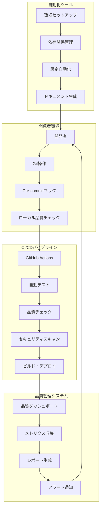
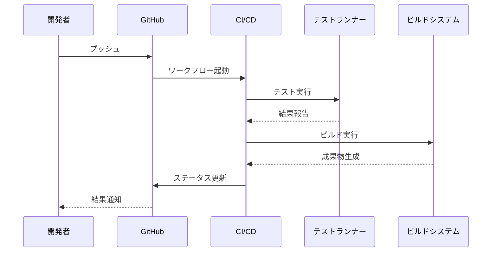

# 設計書

## 概要

Qt-Theme-Studioプロジェクト向けの統合ワークフロー管理システムの設計書です。既存のスクリプト群を基盤として、自動化されたCI/CDパイプライン、開発環境セットアップ、品質管理システムを構築します。

## アーキテクチャ

### システム全体構成



### コンポーネント設計

#### 1. Pre-commitフックシステム

**目的**: コミット前の自動品質チェック

**構成要素**:
- `.pre-commit-config.yaml`: フック設定
- `scripts/pre_commit_setup.py`: 自動セットアップスクリプト
- `scripts/quality_check.py`: 統合品質チェック

**フロー**:
1. 開発者がコミット実行
2. Pre-commitフックが起動
3. Ruffによるリンティング・フォーマット
4. 基本テストの実行
5. 日本語ログメッセージの検証
6. 問題があれば日本語でエラー表示、コミット阻止

#### 2. CI/CDパイプライン

**目的**: 自動化されたテスト・ビルド・デプロイ

**構成要素**:
- `.github/workflows/ci.yml`: メインCI設定
- `.github/workflows/release.yml`: リリース自動化
- `scripts/ci_runner.py`: CI実行制御スクリプト

**フロー**:


#### 3. 品質管理システム

**目的**: 継続的な品質監視とメトリクス管理

**構成要素**:
- `scripts/quality_dashboard.py`: 既存ダッシュボード拡張
- `scripts/metrics_collector.py`: メトリクス収集
- `scripts/alert_manager.py`: アラート管理

**メトリクス**:
- テストカバレッジ
- コード品質スコア
- パフォーマンス指標
- セキュリティスキャン結果
- 依存関係の健全性

#### 4. 開発環境自動化

**目的**: 新規開発者の迅速なオンボーディング

**構成要素**:
- `scripts/dev_setup.py`: 開発環境セットアップ
- `scripts/dependency_manager.py`: 依存関係管理
- `scripts/qt_detector.py`: Qt フレームワーク自動検出

## コンポーネントと インターフェース

### 1. ワークフロー制御エンジン

```python
class WorkflowEngine:
    """ワークフロー制御の中核クラス"""

    def __init__(self, config_path: str):
        self.config = self.load_config(config_path)
        self.logger = self.setup_logger()

    def execute_pipeline(self, pipeline_name: str) -> WorkflowResult:
        """指定されたパイプラインを実行"""
        pass

    def validate_environment(self) -> bool:
        """環境の妥当性を検証"""
        pass
```

### 2. 品質チェッカー

```python
class QualityChecker:
    """統合品質チェック"""

    def run_ruff_checks(self) -> CheckResult:
        """Ruffによるリンティング・フォーマット"""
        pass

    def run_tests(self, test_type: str = "all") -> TestResult:
        """テスト実行"""
        pass

    def check_security(self) -> SecurityResult:
        """セキュリティチェック"""
        pass
```

### 3. 環境マネージャー

```python
class EnvironmentManager:
    """開発環境管理"""

    def setup_development_environment(self) -> bool:
        """開発環境のセットアップ"""
        pass

    def detect_qt_framework(self) -> QtFramework:
        """Qtフレームワークの自動検出"""
        pass

    def install_dependencies(self, requirements: List[str]) -> bool:
        """依存関係のインストール"""
        pass
```

### 4. 通知システム

```python
class NotificationManager:
    """通知管理"""

    def send_alert(self, alert: Alert) -> bool:
        """アラート送信"""
        pass

    def generate_report(self, report_type: str) -> Report:
        """レポート生成"""
        pass
```

## データモデル

### 1. ワークフロー設定

```yaml
# .kiro/workflow/config.yml
workflows:
  pre_commit:
    enabled: true
    checks:
      - ruff_lint
      - ruff_format
      - basic_tests
      - japanese_logs

  ci_pipeline:
    triggers:
      - push
      - pull_request
    stages:
      - quality_check
      - full_tests
      - security_scan
      - build

  release:
    triggers:
      - tag_created
    stages:
      - final_tests
      - build_packages
      - create_archives
      - generate_checksums

quality_thresholds:
  coverage_minimum: 80
  test_success_rate: 95
  security_score: 8.0
```

### 2. 品質メトリクス

```python
@dataclass
class QualityMetrics:
    """品質メトリクスデータモデル"""
    timestamp: datetime
    test_coverage: float
    test_count: int
    success_rate: float
    security_score: float
    performance_score: float
    code_quality_grade: str

@dataclass
class WorkflowResult:
    """ワークフロー実行結果"""
    workflow_name: str
    status: str  # SUCCESS, FAILURE, WARNING
    execution_time: float
    steps: List[StepResult]
    artifacts: List[str]
```

## エラーハンドリング

### 1. エラー分類

```python
class WorkflowError(Exception):
    """ワークフロー関連エラーの基底クラス"""
    pass

class QualityCheckError(WorkflowError):
    """品質チェックエラー"""
    pass

class EnvironmentSetupError(WorkflowError):
    """環境セットアップエラー"""
    pass

class DependencyError(WorkflowError):
    """依存関係エラー"""
    pass
```

### 2. エラー処理戦略

- **自動復旧**: 一時的なエラーに対する自動リトライ
- **グレースフルデグラデーション**: 部分的な機能停止での継続
- **詳細ログ**: 日本語での分かりやすいエラーメッセージ
- **アラート通知**: 重要なエラーの即座な通知

## テスト戦略

### 1. テスト階層

```
単体テスト (Unit Tests)
├── ワークフローエンジン
├── 品質チェッカー
├── 環境マネージャー
└── 通知システム

統合テスト (Integration Tests)
├── CI/CDパイプライン
├── Pre-commitフロー
└── 品質ダッシュボード

エンドツーエンドテスト (E2E Tests)
├── 完全な開発フロー
├── リリースプロセス
└── 障害復旧シナリオ
```

### 2. テスト自動化

```python
class WorkflowTestSuite:
    """ワークフローテストスイート"""

    def test_pre_commit_flow(self):
        """Pre-commitフローのテスト"""
        pass

    def test_ci_pipeline(self):
        """CIパイプラインのテスト"""
        pass

    def test_quality_dashboard(self):
        """品質ダッシュボードのテスト"""
        pass
```

### 3. パフォーマンステスト

- **ワークフロー実行時間**: 各段階の実行時間測定
- **リソース使用量**: CPU・メモリ使用量の監視
- **スケーラビリティ**: 大規模プロジェクトでの動作確認

## セキュリティ考慮事項

### 1. 認証・認可

- **GitHub Actions**: シークレット管理
- **依存関係**: 信頼できるソースからのインストール
- **実行権限**: 最小権限の原則

### 2. セキュリティスキャン

```python
class SecurityScanner:
    """セキュリティスキャナー"""

    def scan_dependencies(self) -> SecurityReport:
        """依存関係の脆弱性スキャン"""
        # Bandit + Safety の統合
        pass

    def scan_code(self) -> CodeSecurityReport:
        """コードのセキュリティスキャン"""
        pass

    def validate_configurations(self) -> ConfigSecurityReport:
        """設定ファイルのセキュリティ検証"""
        pass
```

### 3. データ保護

- **ログの匿名化**: 個人情報の除去
- **設定の暗号化**: 機密設定の保護
- **アクセス制御**: 適切な権限管理

## パフォーマンス最適化

### 1. 実行時間最適化

```python
class PerformanceOptimizer:
    """パフォーマンス最適化"""

    def optimize_test_execution(self):
        """テスト実行の最適化"""
        # 並列実行、キャッシュ活用
        pass

    def optimize_build_process(self):
        """ビルドプロセスの最適化"""
        # 増分ビルド、アーティファクトキャッシュ
        pass
```

### 2. リソース管理

- **メモリ使用量**: 大量データ処理時の最適化
- **ディスク容量**: 一時ファイルの適切な管理
- **ネットワーク**: 依存関係ダウンロードの効率化

## 国際化対応

### 1. 多言語サポート

```python
class LocalizationManager:
    """国際化管理"""

    def get_message(self, key: str, lang: str = "ja") -> str:
        """ローカライズされたメッセージを取得"""
        pass

    def format_error_message(self, error: Exception, lang: str = "ja") -> str:
        """エラーメッセージのフォーマット"""
        pass
```

### 2. 文字エンコーディング

- **UTF-8統一**: すべてのファイルでUTF-8使用
- **日本語対応**: 日本語ファイル名・パスの適切な処理
- **文字化け防止**: エンコーディング明示的指定

## 監視とログ

### 1. ログ戦略

```python
class WorkflowLogger:
    """ワークフロー専用ログ"""

    def __init__(self):
        self.logger = self.setup_japanese_logger()

    def log_workflow_start(self, workflow_name: str):
        """ワークフロー開始ログ"""
        self.logger.info(f"ワークフロー '{workflow_name}' を開始しました")

    def log_step_completion(self, step_name: str, duration: float):
        """ステップ完了ログ"""
        self.logger.info(f"ステップ '{step_name}' が完了しました (実行時間: {duration:.2f}秒)")
```

### 2. メトリクス収集

- **実行時間**: 各ワークフローステップの時間測定
- **成功率**: ワークフロー成功率の追跡
- **エラー頻度**: エラーパターンの分析
- **リソース使用量**: システムリソースの監視

## 拡張性設計

### 1. プラグインアーキテクチャ

```python
class WorkflowPlugin:
    """ワークフロープラグイン基底クラス"""

    def get_name(self) -> str:
        """プラグイン名"""
        pass

    def execute(self, context: WorkflowContext) -> PluginResult:
        """プラグイン実行"""
        pass
```

### 2. 設定の柔軟性

- **YAML設定**: 人間が読みやすい設定形式
- **環境変数**: 環境固有の設定オーバーライド
- **動的設定**: 実行時の設定変更対応

## 運用・保守

### 1. 自動更新機能

```python
class UpdateManager:
    """更新管理"""

    def check_for_updates(self) -> List[Update]:
        """更新チェック"""
        pass

    def apply_updates(self, updates: List[Update]) -> bool:
        """更新適用"""
        pass
```

### 2. 障害対応

- **自動復旧**: 一時的な障害からの自動回復
- **ロールバック**: 問題のある更新の自動取り消し
- **アラート**: 重要な問題の即座な通知

この設計により、Qt-Theme-Studioプロジェクトの開発効率と品質を大幅に向上させる統合ワークフローシステムを構築できます。
